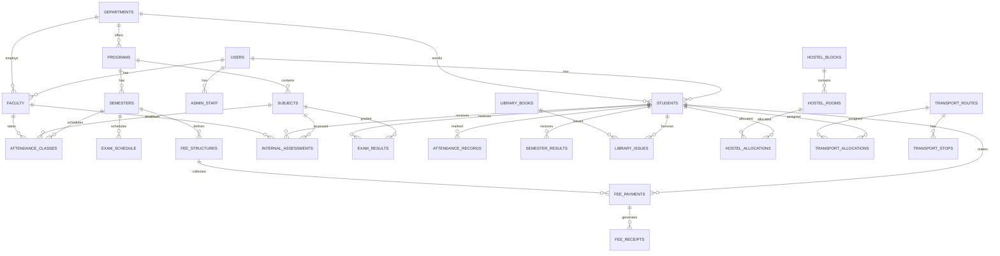

# SPCET College Management System - Complete Architecture

## System Overview

**Project Name:** SPCET CMS (College Management System)  
**Institution:** St. Peter's College of Engineering and Technology  
**Location:** Avadi, Chennai, Tamil Nadu - 600 054  
**Type:** Autonomous Institution (Anna University Affiliated)  
**Counselling Code:** 1127

---

## 1. Technology Stack

### Frontend
- **Framework:** Next.js 14+ (App Router)
- **UI Library:** Tailwind CSS + Shadcn/UI components
- **State Management:** React Server Components + Client Components
- **Forms:** React Hook Form + Zod validation
- **Charts:** Recharts or Chart.js

### Backend
- **Runtime:** Node.js (via Next.js API Routes)
- **Database:** PostgreSQL (Supabase)
- **Authentication:** Supabase Auth
- **File Storage:** Supabase Storage
- **Real-time:** Supabase Realtime (for notifications)

### Third-Party Integrations
- **Payment:** Razorpay (configurable)
- **SMS:** MSG91 (configurable)
- **Email:** SMTP/Gmail (configurable)
- **WhatsApp:** WhatsApp Business API (configurable)
- **Google Sheets:** Google Sheets API for data import/export

### Deployment
- **Platform:** Vercel (free tier for hobby)
- **Database:** Supabase (free tier: 500MB, 50k MAU)
- **Environment Variables:** Single connection link switching

---

## 2. System Architecture Diagram

```
┌─────────────────────────────────────────────────────────────────┐
│                         FRONTEND                                │
│  ┌─────────────┐  ┌─────────────┐  ┌─────────────┐            │
│  │   Student    │  │   Faculty   │  │    Admin     │            │
│  │   Portal     │  │   Portal    │  │   Portal     │            │
│  └──────┬──────┘  └──────┬──────┘  └──────┬──────┘            │
│         │                │                │                     │
│         └────────────────┼────────────────┘                     │
│                          │                                      │
│                    ┌─────▼─────┐                                │
│                    │  Next.js   │                                │
│                    │   App      │                                │
│                    └─────┬─────┘                                │
└──────────────────────────┼──────────────────────────────────────┘
                           │
                    ┌──────▼──────┐
                    │   Supabase   │
                    │   Backend    │
                    └──────┬──────┘
                           │
         ┌─────────────────┼─────────────────┐
         │                 │                 │
    ┌────▼────┐      ┌────▼────┐      ┌────▼────┐
    │ Database │      │  Auth   │      │ Storage │
    │PostgreSQL│      │         │      │         │
    └─────────┘      └─────────┘      └─────────┘
                           │
              ┌────────────┼────────────┐
              │            │            │
         ┌────▼────┐  ┌────▼────┐  ┌────▼────┐
         │ Razorpay│  │  MSG91  │  │  Gmail  │
         │ Payment │  │   SMS   │  │  Email  │
         └─────────┘  └─────────┘  └─────────┘
```

---

## 3. User Roles & Permissions

### Role Hierarchy
```
Super Admin (You)
    └── College Admin (Staff)
        └── HOD (Department Head)
            └── Faculty
                └── Student
```

### Permission Matrix

| Module | Super Admin | College Admin | HOD | Faculty | Student |
|--------|-------------|---------------|-----|---------|---------|
| Dashboard | Full | Full | Dept Only | Class Only | Own |
| Students | CRUD | CRU | Read | Read (Class) | Read (Own) |
| Faculty | CRUD | CRU | Read | - | - |
| Attendance | CRUD | CRU | Read | CRU (Class) | Read (Own) |
| Exams/Grades | CRUD | CRU | Read | Read | Read (Own) |
| Fees | CRUD | CRU | Read | - | Read (Own) |
| Library | CRUD | CRU | Read | Read | Borrow |
| Hostel | CRUD | CRU | Read | - | Read (Own) |
| Transport | CRUD | CRU | Read | - | Read (Own) |
| Documents | CRUD | CRU | Approve | Upload | Upload |
| Reports | Full | Full | Dept | Limited | Own |
| Settings | Full | Limited | - | - | - |
| Payroll | Full | CRU | - | - | - |

---

## 4. Database Schema

### Core Tables

#### 4.1 Academic Structure
```sql
-- Departments
CREATE TABLE departments (
    id UUID PRIMARY KEY DEFAULT gen_random_uuid(),
    code VARCHAR(10) UNIQUE NOT NULL, -- e.g., 'CSE', 'ECE'
    name VARCHAR(200) NOT NULL,
    short_name VARCHAR(50),
    hod_id UUID REFERENCES faculty(id),
    is_active BOOLEAN DEFAULT true,
    created_at TIMESTAMPTZ DEFAULT NOW(),
    updated_at TIMESTAMPTZ DEFAULT NOW()
);

-- Programs
CREATE TABLE programs (
    id UUID PRIMARY KEY DEFAULT gen_random_uuid(),
    department_id UUID REFERENCES departments(id),
    code VARCHAR(20) UNIQUE NOT NULL, -- e.g., 'BTECH_CSE'
    name VARCHAR(200) NOT NULL,
    type VARCHAR(20) NOT NULL, -- 'UG', 'PG', 'PHD'
    duration_years INT NOT NULL,
    total_semesters INT NOT NULL,
    total_credits INT,
    grading_system VARCHAR(50) NOT NULL, -- 'marks_percentage', 'gpa', 'cgpa', 'credit_based'
    is_active BOOLEAN DEFAULT true,
    created_at TIMESTAMPTZ DEFAULT NOW()
);

-- Academic Years
CREATE TABLE academic_years (
    id UUID PRIMARY KEY DEFAULT gen_random_uuid(),
    year VARCHAR(20) UNIQUE NOT NULL, -- '2024-25'
    start_date DATE NOT NULL,
    end_date DATE NOT NULL,
    is_current BOOLEAN DEFAULT false,
    created_at TIMESTAMPTZ DEFAULT NOW()
);

-- Semesters
CREATE TABLE semesters (
    id UUID PRIMARY KEY DEFAULT gen_random_uuid(),
    academic_year_id UUID REFERENCES academic_years(id),
    program_id UUID REFERENCES programs(id),
    semester_number INT NOT NULL,
    start_date DATE NOT NULL,
    end_date DATE NOT NULL,
    is_current BOOLEAN DEFAULT false,
    created_at TIMESTAMPTZ DEFAULT NOW(),
    UNIQUE(academic_year_id, program_id, semester_number)
);

-- Subjects/Courses
CREATE TABLE subjects (
    id UUID PRIMARY KEY DEFAULT gen_random_uuid(),
    program_id UUID REFERENCES programs(id),
    semester INT NOT NULL,
    code VARCHAR(20) NOT NULL,
    name VARCHAR(200) NOT NULL,
    type VARCHAR(20) NOT NULL, -- 'theory', 'practical', 'project'
    credits INT NOT NULL,
    lecture_hours INT,
    tutorial_hours INT,
    practical_hours INT,
    is_elective BOOLEAN DEFAULT false,
    is_active BOOLEAN DEFAULT true,
    created_at TIMESTAMPTZ DEFAULT NOW(),
    UNIQUE(program_id, code)
);
```

#### 4.2 User Management
```sql
-- Users (Base table for all user types)
CREATE TABLE users (
    id UUID PRIMARY KEY REFERENCES auth.users(id),
    email VARCHAR(255) UNIQUE,
    phone VARCHAR(20),
    role VARCHAR(20) NOT NULL, -- 'super_admin', 'admin', 'hod', 'faculty', 'student'
    is_active BOOLEAN DEFAULT true,
    last_login TIMESTAMPTZ,
    created_at TIMESTAMPTZ DEFAULT NOW(),
    updated_at TIMESTAMPTZ DEFAULT NOW()
);

-- Students
CREATE TABLE students (
    id UUID PRIMARY KEY DEFAULT gen_random_uuid(),
    user_id UUID REFERENCES users(id),
    roll_number VARCHAR(20) UNIQUE NOT NULL,
    admission_number VARCHAR(20) UNIQUE,
    program_id UUID REFERENCES programs(id),
    department_id UUID REFERENCES departments(id),
    current_semester INT NOT NULL,
    admission_date DATE NOT NULL,
    batch_year INT NOT NULL, -- e.g., 2024
    status VARCHAR(20) DEFAULT 'active', -- 'active', 'inactive', 'passed_out', 'dropped'
    -- Personal Info
    first_name VARCHAR(100) NOT NULL,
    last_name VARCHAR(100) NOT NULL,
    date_of_birth DATE,
    gender VARCHAR(10),
    blood_group VARCHAR(5),
    nationality VARCHAR(50),
    religion VARCHAR(50),
    community VARCHAR(20),
    -- Contact Info
    address TEXT,
    city VARCHAR(100),
    state VARCHAR(100),
    pincode VARCHAR(10),
    -- Parent/Guardian Info
    father_name VARCHAR(200),
    father_phone VARCHAR(20),
    father_occupation VARCHAR(100),
    mother_name VARCHAR(200),
    mother_phone VARCHAR(20),
    guardian_name VARCHAR(200),
    guardian_phone VARCHAR(20),
    -- Academic Info
    tenth_percentage DECIMAL(5,2),
    twelfth_percentage DECIMAL(5,2),
    cut_off_marks DECIMAL(5,2),
    entrance_exam_score DECIMAL(5,2),
    -- Documents
    photo_url TEXT,
    signature_url TEXT,
    created_at TIMESTAMPTZ DEFAULT NOW(),
    updated_at TIMESTAMPTZ DEFAULT NOW()
);

-- Faculty
CREATE TABLE faculty (
    id UUID PRIMARY KEY DEFAULT gen_random_uuid(),
    user_id UUID REFERENCES users(id),
    employee_id VARCHAR(20) UNIQUE NOT NULL,
    department_id UUID REFERENCES departments(id),
    designation VARCHAR(100) NOT NULL,
    qualification VARCHAR(200),
    specialization VARCHAR(200),
    experience_years INT,
    date_of_joining DATE,
    employment_type VARCHAR(20), -- 'permanent', 'contract', 'visiting'
    salary DECIMAL(12,2),
    -- Personal Info
    first_name VARCHAR(100) NOT NULL,
    last_name VARCHAR(100) NOT NULL,
    date_of_birth DATE,
    gender VARCHAR(10),
    phone VARCHAR(20),
    email VARCHAR(255),
    address TEXT,
    -- Documents
    photo_url TEXT,
    resume_url TEXT,
    is_active BOOLEAN DEFAULT true,
    created_at TIMESTAMPTZ DEFAULT NOW(),
    updated_at TIMESTAMPTZ DEFAULT NOW()
);

-- Admin Staff
CREATE TABLE admin_staff (
    id UUID PRIMARY KEY DEFAULT gen_random_uuid(),
    user_id UUID REFERENCES users(id),
    employee_id VARCHAR(20) UNIQUE NOT NULL,
    department VARCHAR(100),
    designation VARCHAR(100) NOT NULL,
    first_name VARCHAR(100) NOT NULL,
    last_name VARCHAR(100) NOT NULL,
    phone VARCHAR(20),
    email VARCHAR(255),
    is_active BOOLEAN DEFAULT true,
    created_at TIMESTAMPTZ DEFAULT NOW()
);
```

#### 4.3 Attendance
```sql
-- Attendance Classes
CREATE TABLE attendance_classes (
    id UUID PRIMARY KEY DEFAULT gen_random_uuid(),
    subject_id UUID REFERENCES subjects(id),
    faculty_id UUID REFERENCES faculty(id),
    semester_id UUID REFERENCES semesters(id),
    date DATE NOT NULL,
    start_time TIME NOT NULL,
    end_time TIME NOT NULL,
    class_type VARCHAR(20), -- 'lecture', 'lab', 'tutorial'
    room VARCHAR(50),
    status VARCHAR(20) DEFAULT 'scheduled', -- 'scheduled', 'completed', 'cancelled'
    created_at TIMESTAMPTZ DEFAULT NOW()
);

-- Attendance Records
CREATE TABLE attendance_records (
    id UUID PRIMARY KEY DEFAULT gen_random_uuid(),
    class_id UUID REFERENCES attendance_classes(id),
    student_id UUID REFERENCES students(id),
    status VARCHAR(10) NOT NULL, -- 'P', 'A', 'L', 'OD'
    remarks TEXT,
    marked_by UUID REFERENCES faculty(id),
    marked_at TIMESTAMPTZ DEFAULT NOW(),
    UNIQUE(class_id, student_id)
);

-- Attendance Summary (Materialized view for performance)
CREATE MATERIALIZED VIEW attendance_summary AS
SELECT 
    s.id as student_id,
    s.roll_number,
    sub.id as subject_id,
    sub.code as subject_code,
    COUNT(CASE WHEN ar.status = 'P' THEN 1 END) as present,
    COUNT(CASE WHEN ar.status = 'A' THEN 1 END) as absent,
    COUNT(CASE WHEN ar.status = 'L' THEN 1 END) as late,
    COUNT(CASE WHEN ar.status = 'OD' THEN 1 END) as on_duty,
    COUNT(ar.id) as total_classes,
    ROUND(COUNT(CASE WHEN ar.status = 'P' THEN 1 END)::DECIMAL / COUNT(ar.id) * 100, 2) as percentage
FROM students s
JOIN attendance_records ar ON s.id = ar.student_id
JOIN attendance_classes ac ON ar.class_id = ac.id
JOIN subjects sub ON ac.subject_id = sub.id
GROUP BY s.id, s.roll_number, sub.id, sub.code;
```

#### 4.4 Examinations & Grades
```sql
-- Exam Schedule
CREATE TABLE exam_schedule (
    id UUID PRIMARY KEY DEFAULT gen_random_uuid(),
    semester_id UUID REFERENCES semesters(id),
    subject_id UUID REFERENCES subjects(id),
    exam_type VARCHAR(20) NOT NULL, -- 'internal', 'external', 'practical', 'viva'
    exam_date DATE NOT NULL,
    start_time TIME NOT NULL,
    end_time TIME NOT NULL,
    room VARCHAR(50),
    max_marks INT NOT NULL,
    min_marks INT NOT NULL,
    created_at TIMESTAMPTZ DEFAULT NOW()
);

-- Internal Assessments
CREATE TABLE internal_assessments (
    id UUID PRIMARY KEY DEFAULT gen_random_uuid(),
    student_id UUID REFERENCES students(id),
    subject_id UUID REFERENCES subjects(id),
    semester_id UUID REFERENCES semesters(id),
    assessment_type VARCHAR(20), -- 'test1', 'test2', 'assignment', 'viva'
    marks_obtained DECIMAL(5,2),
    max_marks DECIMAL(5,2),
    assessed_by UUID REFERENCES faculty(id),
    assessed_at TIMESTAMPTZ DEFAULT NOW(),
    created_at TIMESTAMPTZ DEFAULT NOW()
);

-- Exam Results
CREATE TABLE exam_results (
    id UUID PRIMARY KEY DEFAULT gen_random_uuid(),
    student_id UUID REFERENCES students(id),
    subject_id UUID REFERENCES subjects(id),
    semester_id UUID REFERENCES semesters(id),
    exam_type VARCHAR(20), -- 'internal', 'external', 'total'
    marks_obtained DECIMAL(5,2),
    max_marks DECIMAL(5,2),
    grade VARCHAR(5),
    grade_points DECIMAL(3,2),
    credits DECIMAL(3,1),
    result_status VARCHAR(10), -- 'pass', 'fail', 'absent', 'withheld'
    published_at TIMESTAMPTZ,
    created_at TIMESTAMPTZ DEFAULT NOW(),
    UNIQUE(student_id, subject_id, semester_id, exam_type)
);

-- Semester Results
CREATE TABLE semester_results (
    id UUID PRIMARY KEY DEFAULT gen_random_uuid(),
    student_id UUID REFERENCES students(id),
    semester_id UUID REFERENCES semesters(id),
    sgpa DECIMAL(4,2),
    cgpa DECIMAL(4,2),
    total_credits INT,
    earned_credits INT,
    result_status VARCHAR(20), -- 'pass', 'fail', 'promoted', 'detained'
    published_at TIMESTAMPTZ,
    created_at TIMESTAMPTZ DEFAULT NOW(),
    UNIQUE(student_id, semester_id)
);
```

#### 4.5 Fees
```sql
-- Fee Structure
CREATE TABLE fee_structures (
    id UUID PRIMARY KEY DEFAULT gen_random_uuid(),
    program_id UUID REFERENCES programs(id),
    academic_year_id UUID REFERENCES academic_years(id),
    semester INT NOT NULL,
    fee_type VARCHAR(50) NOT NULL, -- 'tuition', 'lab', 'library', 'hostel', 'transport', 'exam', 'other'
    amount DECIMAL(10,2) NOT NULL,
    due_date DATE,
    late_fee DECIMAL(10,2) DEFAULT 0,
    late_fee_after DATE,
    is_mandatory BOOLEAN DEFAULT true,
    created_at TIMESTAMPTZ DEFAULT NOW()
);

-- Student Fee Payments
CREATE TABLE fee_payments (
    id UUID PRIMARY KEY DEFAULT gen_random_uuid(),
    student_id UUID REFERENCES students(id),
    fee_structure_id UUID REFERENCES fee_structures(id),
    amount_paid DECIMAL(10,2) NOT NULL,
    payment_date TIMESTAMPTZ DEFAULT NOW(),
    payment_method VARCHAR(20), -- 'cash', 'online', 'cheque', 'dd'
    transaction_id VARCHAR(100),
    razorpay_order_id VARCHAR(100),
    razorpay_payment_id VARCHAR(100),
    status VARCHAR(20) DEFAULT 'pending', -- 'pending', 'completed', 'failed', 'refunded'
    receipt_number VARCHAR(50),
    remarks TEXT,
    created_at TIMESTAMPTZ DEFAULT NOW()
);

-- Fee Receipts
CREATE TABLE fee_receipts (
    id UUID PRIMARY KEY DEFAULT gen_random_uuid(),
    payment_id UUID REFERENCES fee_payments(id),
    receipt_number VARCHAR(50) UNIQUE NOT NULL,
    receipt_date DATE NOT NULL,
    student_name VARCHAR(200),
    roll_number VARCHAR(20),
    fee_type VARCHAR(50),
    amount DECIMAL(10,2),
    payment_method VARCHAR(20),
    transaction_id VARCHAR(100),
    pdf_url TEXT,
    created_at TIMESTAMPTZ DEFAULT NOW()
);
```

#### 4.6 Library
```sql
-- Books
CREATE TABLE library_books (
    id UUID PRIMARY KEY DEFAULT gen_random_uuid(),
    accession_number VARCHAR(20) UNIQUE NOT NULL,
    isbn VARCHAR(20),
    title VARCHAR(500) NOT NULL,
    author VARCHAR(300),
    publisher VARCHAR(200),
    publication_year INT,
    edition VARCHAR(50),
    category VARCHAR(100),
    department_id UUID REFERENCES departments(id),
    total_copies INT DEFAULT 1,
    available_copies INT DEFAULT 1,
    location VARCHAR(100),
    price DECIMAL(10,2),
    is_reference BOOLEAN DEFAULT false,
    is_active BOOLEAN DEFAULT true,
    created_at TIMESTAMPTZ DEFAULT NOW()
);

-- Book Issues
CREATE TABLE library_issues (
    id UUID PRIMARY KEY DEFAULT gen_random_uuid(),
    book_id UUID REFERENCES library_books(id),
    student_id UUID REFERENCES students(id),
    issue_date DATE NOT NULL,
    due_date DATE NOT NULL,
    return_date DATE,
    renewal_count INT DEFAULT 0,
    fine_amount DECIMAL(10,2) DEFAULT 0,
    status VARCHAR(20) DEFAULT 'issued', -- 'issued', 'returned', 'overdue', 'lost'
    issued_by UUID REFERENCES faculty(id),
    returned_to UUID REFERENCES faculty(id),
    created_at TIMESTAMPTZ DEFAULT NOW()
);
```

#### 4.7 Hostel
```sql
-- Hostel Blocks
CREATE TABLE hostel_blocks (
    id UUID PRIMARY KEY DEFAULT gen_random_uuid(),
    name VARCHAR(100) NOT NULL,
    type VARCHAR(20), -- 'boys', 'girls'
    total_rooms INT,
    warden_name VARCHAR(200),
    warden_phone VARCHAR(20),
    is_active BOOLEAN DEFAULT true,
    created_at TIMESTAMPTZ DEFAULT NOW()
);

-- Hostel Rooms
CREATE TABLE hostel_rooms (
    id UUID PRIMARY KEY DEFAULT gen_random_uuid(),
    block_id UUID REFERENCES hostel_blocks(id),
    room_number VARCHAR(20) NOT NULL,
    floor INT,
    capacity INT NOT NULL,
    occupied INT DEFAULT 0,
    room_type VARCHAR(20), -- 'single', 'double', 'triple', 'shared'
    facilities TEXT[],
    is_active BOOLEAN DEFAULT true,
    created_at TIMESTAMPTZ DEFAULT NOW(),
    UNIQUE(block_id, room_number)
);

-- Hostel Allocations
CREATE TABLE hostel_allocations (
    id UUID PRIMARY KEY DEFAULT gen_random_uuid(),
    student_id UUID REFERENCES students(id),
    room_id UUID REFERENCES hostel_rooms(id),
    academic_year_id UUID REFERENCES academic_years(id),
    allocated_date DATE NOT NULL,
    vacated_date DATE,
    status VARCHAR(20) DEFAULT 'active', -- 'active', 'vacated', 'transferred'
    created_at TIMESTAMPTZ DEFAULT NOW()
);
```

#### 4.8 Transport
```sql
-- Bus Routes
CREATE TABLE transport_routes (
    id UUID PRIMARY KEY DEFAULT gen_random_uuid(),
    route_number VARCHAR(20) UNIQUE NOT NULL,
    route_name VARCHAR(200) NOT NULL,
    start_point VARCHAR(200),
    end_point VARCHAR(200),
    distance_km DECIMAL(5,2),
    fare DECIMAL(8,2),
    is_active BOOLEAN DEFAULT true,
    created_at TIMESTAMPTZ DEFAULT NOW()
);

-- Bus Stops
CREATE TABLE transport_stops (
    id UUID PRIMARY KEY DEFAULT gen_random_uuid(),
    route_id UUID REFERENCES transport_routes(id),
    stop_name VARCHAR(200) NOT NULL,
    stop_order INT NOT NULL,
    arrival_time TIME,
    fare_from_start DECIMAL(8,2),
    created_at TIMESTAMPTZ DEFAULT NOW()
);

-- Transport Allocations
CREATE TABLE transport_allocations (
    id UUID PRIMARY KEY DEFAULT gen_random_uuid(),
    student_id UUID REFERENCES students(id),
    route_id UUID REFERENCES transport_routes(id),
    pickup_stop_id UUID REFERENCES transport_stops(id),
    drop_stop_id UUID REFERENCES transport_stops(id),
    academic_year_id UUID REFERENCES academic_years(id),
    fee_paid BOOLEAN DEFAULT false,
    status VARCHAR(20) DEFAULT 'active',
    created_at TIMESTAMPTZ DEFAULT NOW()
);
```

#### 4.9 Documents
```sql
-- Document Types
CREATE TABLE document_types (
    id UUID PRIMARY KEY DEFAULT gen_random_uuid(),
    name VARCHAR(100) NOT NULL,
    description TEXT,
    required_for VARCHAR(20), -- 'student', 'faculty', 'both'
    max_size_mb INT DEFAULT 5,
    allowed_formats TEXT[] DEFAULT '{pdf,jpg,jpeg,png}',
    is_mandatory BOOLEAN DEFAULT false,
    created_at TIMESTAMPTZ DEFAULT NOW()
);

-- Documents
CREATE TABLE documents (
    id UUID PRIMARY KEY DEFAULT gen_random_uuid(),
    user_id UUID REFERENCES users(id),
    document_type_id UUID REFERENCES document_types(id),
    file_name VARCHAR(200) NOT NULL,
    file_url TEXT NOT NULL,
    file_size INT,
    file_type VARCHAR(20),
    status VARCHAR(20) DEFAULT 'pending', -- 'pending', 'approved', 'rejected'
    remarks TEXT,
    verified_by UUID REFERENCES users(id),
    verified_at TIMESTAMPTZ,
    created_at TIMESTAMPTZ DEFAULT NOW()
);
```

#### 4.10 Notifications
```sql
-- Notification Templates
CREATE TABLE notification_templates (
    id UUID PRIMARY KEY DEFAULT gen_random_uuid(),
    name VARCHAR(100) NOT NULL,
    type VARCHAR(20), -- 'sms', 'email', 'whatsapp', 'push'
    subject VARCHAR(200),
    body TEXT NOT NULL,
    variables JSONB, -- template variables
    is_active BOOLEAN DEFAULT true,
    created_at TIMESTAMPTZ DEFAULT NOW()
);

-- Notifications Log
CREATE TABLE notifications (
    id UUID PRIMARY KEY DEFAULT gen_random_uuid(),
    user_id UUID REFERENCES users(id),
    template_id UUID REFERENCES notification_templates(id),
    type VARCHAR(20) NOT NULL,
    subject VARCHAR(200),
    body TEXT NOT NULL,
    status VARCHAR(20) DEFAULT 'pending', -- 'pending', 'sent', 'delivered', 'failed'
    sent_at TIMESTAMPTZ,
    delivered_at TIMESTAMPTZ,
    error_message TEXT,
    created_at TIMESTAMPTZ DEFAULT NOW()
);
```

#### 4.11 Payroll
```sql
-- Salary Components
CREATE TABLE salary_components (
    id UUID PRIMARY KEY DEFAULT gen_random_uuid(),
    name VARCHAR(100) NOT NULL,
    type VARCHAR(20), -- 'earning', 'deduction'
    is_fixed BOOLEAN DEFAULT true,
    calculation_type VARCHAR(20), -- 'percentage', 'fixed'
    percentage DECIMAL(5,2),
    created_at TIMESTAMPTZ DEFAULT NOW()
);

-- Monthly Salary
CREATE TABLE monthly_salary (
    id UUID PRIMARY KEY DEFAULT gen_random_uuid(),
    faculty_id UUID REFERENCES faculty(id),
    month INT NOT NULL,
    year INT NOT NULL,
    basic_salary DECIMAL(12,2),
    earnings JSONB, -- {"hra": 5000, "da": 3000, ...}
    deductions JSONB, -- {"pf": 1800, "esi": 0, ...}
    gross_salary DECIMAL(12,2),
    net_salary DECIMAL(12,2),
    payment_date DATE,
    payment_method VARCHAR(20),
    transaction_id VARCHAR(100),
    status VARCHAR(20) DEFAULT 'pending', -- 'pending', 'paid', 'on_hold'
    created_at TIMESTAMPTZ DEFAULT NOW(),
    UNIQUE(faculty_id, month, year)
);
```

#### 4.12 System Configuration
```sql
-- College Settings
CREATE TABLE college_settings (
    id UUID PRIMARY KEY DEFAULT gen_random_uuid(),
    setting_key VARCHAR(100) UNIQUE NOT NULL,
    setting_value JSONB NOT NULL,
    setting_type VARCHAR(20), -- 'text', 'number', 'boolean', 'json', 'file'
    description TEXT,
    updated_by UUID REFERENCES users(id),
    updated_at TIMESTAMPTZ DEFAULT NOW()
);

-- Academic Config
CREATE TABLE academic_config (
    id UUID PRIMARY KEY DEFAULT gen_random_uuid(),
    program_id UUID REFERENCES programs(id),
    config_key VARCHAR(100) NOT NULL,
    config_value JSONB NOT NULL,
    created_at TIMESTAMPTZ DEFAULT NOW(),
    UNIQUE(program_id, config_key)
);

-- Audit Logs
CREATE TABLE audit_logs (
    id UUID PRIMARY KEY DEFAULT gen_random_uuid(),
    user_id UUID REFERENCES users(id),
    action VARCHAR(50) NOT NULL,
    table_name VARCHAR(100),
    record_id UUID,
    old_data JSONB,
    new_data JSONB,
    ip_address INET,
    user_agent TEXT,
    created_at TIMESTAMPTZ DEFAULT NOW()
);
```

---

## 5. Module Breakdown

### Phase 1: Core Foundation (Week 1-2)
1. **Authentication System**
   - Login/Register
   - Role-based access control
   - Password reset
   - Session management

2. **User Management**
   - Student CRUD
   - Faculty CRUD
   - Admin CRUD
   - Profile management

3. **Academic Structure**
   - Department management
   - Program management
   - Semester management
   - Subject management

### Phase 2: Academic Operations (Week 3-4)
4. **Attendance Module**
   - Class scheduling
   - Attendance marking (faculty)
   - Attendance viewing (students)
   - Attendance reports
   - Bulk import

5. **Examination Module**
   - Exam schedule creation
   - Internal assessment entry
   - Grade entry
   - Result publication
   - Grade cards

### Phase 3: Financial Operations (Week 5-6)
6. **Fee Management**
   - Fee structure configuration
   - Fee collection
   - Payment gateway integration
   - Receipt generation
   - Outstanding reports

7. **Payroll Module**
   - Salary component configuration
   - Monthly salary processing
   - Payslip generation
   - Salary reports

### Phase 4: Student Services (Week 7-8)
8. **Library Module**
   - Book catalog
   - Issue/Return
   - Fine calculation
   - Search functionality

9. **Hostel Module**
   - Room management
   - Allocation
   - Complaints
   - Fee tracking

10. **Transport Module**
    - Route management
    - Stop management
    - Allocation
    - Fee tracking

### Phase 5: Communication & Reports (Week 9-10)
11. **Notification System**
    - SMS integration
    - Email integration
    - WhatsApp integration
    - Push notifications

12. **Document Management**
    - Upload/Download
    - Approval workflow
    - Version control

13. **Reporting Module**
    - Dashboard analytics
    - Custom reports
    - Export (PDF/Excel)
    - NAAC/NBA reports

### Phase 6: Advanced Features (Week 11-12)
14. **Google Sheets Integration**
    - Import from sheets
    - Export to sheets
    - Sync functionality

15. **Admin Settings**
    - College branding
    - Academic year config
    - Grading rules
    - Notification templates

---

## 6. Deployment Strategy

### Environment Variables
```env
# Database
NEXT_PUBLIC_SUPABASE_URL=https://your-project.supabase.co
NEXT_PUBLIC_SUPABASE_ANON_KEY=your-anon-key
SUPABASE_SERVICE_ROLE_KEY=your-service-role-key

# Payment
RAZORPAY_KEY_ID=your-key
RAZORPAY_KEY_SECRET=your-secret

# SMS
MSG91_API_KEY=your-key
MSG91_SENDER_ID=your-sender

# Email
SMTP_HOST=smtp.gmail.com
SMTP_PORT=587
SMTP_USER=your-email
SMTP_PASS=your-password

# Google Sheets
GOOGLE_SHEETS_CREDENTIALS=your-credentials
```

### Deployment Process
1. **Development:** Local + Supabase Dev Project
2. **Testing:** Vercel Preview + Supabase Test Project
3. **Production:** Vercel Production + Supabase Production

### Switching Environments
```bash
# Change one file to switch environments
cp .env.local .env.production
# Update NEXT_PUBLIC_SUPABASE_URL and keys
```

---

## 7. API Structure

### Authentication
```
POST /api/auth/login
POST /api/auth/register
POST /api/auth/logout
POST /api/auth/forgot-password
POST /api/auth/reset-password
```

### Students
```
GET    /api/students
GET    /api/students/:id
POST   /api/students
PUT    /api/students/:id
DELETE /api/students/:id
GET    /api/students/:id/attendance
GET    /api/students/:id/grades
GET    /api/students/:id/fees
```

### Faculty
```
GET    /api/faculty
GET    /api/faculty/:id
POST   /api/faculty
PUT    /api/faculty/:id
DELETE /api/faculty/:id
```

### Attendance
```
GET    /api/attendance
POST   /api/attendance
PUT    /api/attendance/:id
GET    /api/attendance/report
POST   /api/attendance/bulk-import
```

### Exams
```
GET    /api/exams
POST   /api/exams
PUT    /api/exams/:id
GET    /api/exams/:id/results
POST   /api/exams/:id/results
GET    /api/exams/:id/results/publish
```

### Fees
```
GET    /api/fees
POST   /api/fees
GET    /api/fees/structure
POST   /api/fees/collect
GET    /api/fees/receipt/:id
POST   /api/fees/payment/razorpay
```

### Library
```
GET    /api/library/books
POST   /api/library/books
GET    /api/library/books/:id
POST   /api/library/issue
POST   /api/library/return
GET    /api/library/my-books
```

### Notifications
```
POST   /api/notifications/send
GET    /api/notifications
PUT    /api/notifications/:id/read
POST   /api/notifications/bulk-send
```

### Reports
```
GET    /api/reports/attendance
GET    /api/reports/grades
GET    /api/reports/fees
GET    /api/reports/placement
GET    /api/reports/naac
GET    /api/reports/export/:type
```

---

## 8. Security Considerations

### Authentication
- JWT tokens with short expiry
- Refresh token rotation
- Rate limiting on login attempts
- Password hashing with bcrypt

### Authorization
- Row Level Security (RLS) in Supabase
- Role-based middleware checks
- API route protection

### Data Protection
- Input validation with Zod
- SQL injection prevention (parameterized queries)
- XSS protection
- CSRF tokens
- File upload validation

### Audit
- All CRUD operations logged
- IP address tracking
- User agent logging

---

## 9. Performance Optimizations

### Database
- Proper indexing on frequently queried columns
- Materialized views for complex reports
- Connection pooling via Supabase
- Pagination for all list endpoints

### Frontend
- Server Components for initial load
- Client Components for interactivity
- Image optimization with Next.js Image
- Code splitting and lazy loading
- SWR for data fetching

### Caching
- Static page caching
- API response caching
- Redis for session storage (optional)

---

## 10. Scalability Considerations

### Current Scale
- Students: ~1,150
- Faculty: ~100
- Admin: ~10
- Total Users: ~1,260

### Supabase Free Tier Limits
- Database: 500MB (sufficient for 5+ years)
- Storage: 1GB (sufficient for documents)
- API Requests: 500K/month
- Auth: 50,000 MAU
- Realtime: 200 concurrent connections

### Growth Path
1. Start with Supabase Free Tier
2. Upgrade to Supabase Pro ($25/month) when needed
3. Add Redis caching if needed
4. Consider dedicated server for 5,000+ students

---

## 11. Backup & Recovery

### Automated Backups
- Supabase: Daily backups (Free: 7 days, Pro: 30 days)
- Vercel: Automatic deployments

### Manual Backup
```bash
# Database backup
pg_dump $DATABASE_URL > backup_$(date +%Y%m%d).sql

# Storage backup
supabase storage download --bucket documents ./backup/
```

### Recovery Process
1. Restore database from backup
2. Re-deploy application
3. Verify data integrity

---

## 12. Cost Estimate

### Free Tier (Initial)
- Vercel: $0
- Supabase: $0
- Domain: ~₹800/year (optional)
- **Total: ₹800/year**

### Pro Tier (When needed)
- Vercel Pro: $20/month
- Supabase Pro: $25/month
- Razorpay: 2% per transaction
- MSG91: ₹0.20 per SMS
- **Total: ~₹4,000/month + transaction costs**

---

## 13. Development Timeline

### Total Duration: 12-16 Weeks

| Phase | Duration | Deliverables |
|-------|----------|--------------|
| Phase 1 | Week 1-2 | Auth, Users, Academic Structure |
| Phase 2 | Week 3-4 | Attendance, Exams, Grades |
| Phase 3 | Week 5-6 | Fees, Payroll |
| Phase 4 | Week 7-8 | Library, Hostel, Transport |
| Phase 5 | Week 9-10 | Notifications, Documents, Reports |
| Phase 6 | Week 11-12 | Google Sheets, Admin Settings |
| Testing | Week 13-14 | Integration testing, Bug fixes |
| Deployment | Week 15-16 | Production deployment, Training |

---

## 14. Token Estimate (AI Development)

### With OpenCode/Antigravity
- **Total Tokens:** ~500K - 800K tokens
- **Average per module:** ~40K - 60K tokens
- **Breakdown:**
  - Architecture/Planning: ~50K tokens
  - Database Schema: ~80K tokens
  - Authentication: ~40K tokens
  - Each CRUD Module: ~30K tokens
  - Integration: ~50K tokens
  - Testing: ~40K tokens
  - Deployment: ~30K tokens

---

## 15. Risk Mitigation

### Technical Risks
| Risk | Mitigation |
|------|------------|
| Supabase free tier limits | Monitor usage, upgrade path ready |
| Payment gateway issues | Fallback to manual payment recording |
| SMS delivery failures | Email fallback |
| Data loss | Automated backups |

### Operational Risks
| Risk | Mitigation |
|------|------------|
| User adoption | Simple UI, training sessions |
| Data accuracy | Validation, audit logs |
| Security breaches | RLS, encryption, monitoring |

---

## 16. Success Metrics

### Quantitative
- 100% student records digitized
- 95% attendance accuracy
- 90% fee collection efficiency
- 50% reduction in paperwork

### Qualitative
- User satisfaction > 80%
- Admin time savings > 60%
- Error reduction > 70%

---

## 17. Future Enhancements

### Phase 2 (After MVP)
- Mobile app (React Native)
- AI-powered analytics
- Placement cell module
- Alumni network
- Online exam module
- Chatbot for queries

### Phase 3 (Advanced)
- IoT integration (biometric)
- Blockchain certificates
- AR/VR campus tour
- Advanced ML analytics

---

## Appendix A: File Structure

```
spcet-cms/
├── src/
│   ├── app/
│   │   ├── (auth)/
│   │   │   ├── login/
│   │   │   ├── register/
│   │   │   └── forgot-password/
│   │   ├── (dashboard)/
│   │   │   ├── layout.tsx
│   │   │   ├── page.tsx
│   │   │   ├── students/
│   │   │   ├── faculty/
│   │   │   ├── attendance/
│   │   │   ├── exams/
│   │   │   ├── fees/
│   │   │   ├── library/
│   │   │   ├── hostel/
│   │   │   ├── transport/
│   │   │   ├── notifications/
│   │   │   ├── reports/
│   │   │   └── settings/
│   │   ├── api/
│   │   │   ├── auth/
│   │   │   ├── students/
│   │   │   ├── faculty/
│   │   │   ├── attendance/
│   │   │   ├── exams/
│   │   │   ├── fees/
│   │   │   ├── library/
│   │   │   ├── notifications/
│   │   │   └── reports/
│   │   └── layout.tsx
│   ├── components/
│   │   ├── ui/
│   │   ├── forms/
│   │   ├── tables/
│   │   ├── charts/
│   │   └── layout/
│   ├── lib/
│   │   ├── supabase/
│   │   ├── utils/
│   │   ├── validators/
│   │   └── constants/
│   ├── hooks/
│   ├── types/
│   └── styles/
├── public/
├── supabase/
│   ├── migrations/
│   └── seed.sql
├── .env.local
├── .env.production
├── next.config.js
├── tailwind.config.js
├── package.json
└── README.md
```

---

## Appendix B: Database Diagram (Mermaid)



---

**Document Version:** 1.0  
**Last Updated:** August 2026  
**Author:** AI Architecture Team
